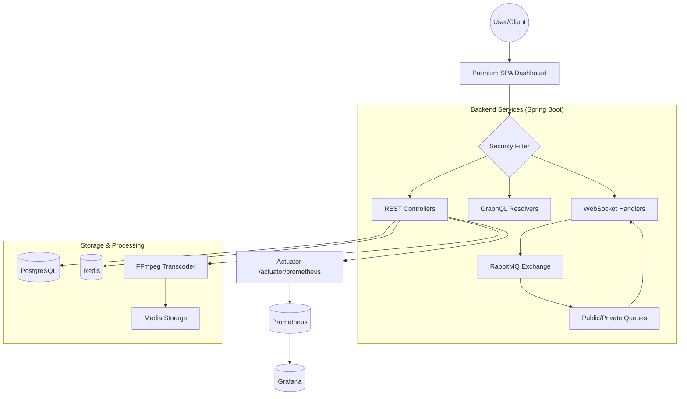

# MediaVault (Code: A0) — Premium Media & Messaging Platform

[](https://spring.io/projects/spring-boot)
[](https://www.oracle.com/java/)
[](https://www.postgresql.org/)
[](https://www.rabbitmq.com/)
[](https://redis.io/)
[](https://prometheus.io/)
[](https://grafana.com/)

A high-performance, enterprise-grade media platform for video/photo streaming, real-time messaging, and secure content management.

## 🌟 Overview

MediaVault (A0) is a robust Single Page Application (SPA) built with Spring Boot 4.x, featuring:
- **Enterprise Media Streaming**: Automatic FFmpeg transcoding with multi-tier quality switching (144p to 4K).
- **Real-Time Communication**: Public and private chat systems powered by WebSockets and RabbitMQ.
- **Zero-Trust Architecture**: Secure JWT-based authentication, API key management, and granular access control.
- **Premium UI/UX**: Professional glassmorphism dashboard with dark-mode aesthetics and fluid transitions.
- **Scalable Infrastructure**: Distributed caching with Redis and asynchronous message processing.
- **Operational Observability**: Spring Actuator metrics with Prometheus scraping and Grafana dashboards.

## 🏗️ Architecture



## 🚀 Tech Stack

| Component | Technology | Version | Description |
|-----------|-----------|---------|-------------|
| **Backend** | Spring Boot | 4.0.5 | Core Framework |
| **Messaging** | RabbitMQ | 3.x | Real-time Message Queuing |
| **Real-time** | WebSockets | STOMP/SockJS | Bi-directional Communication |
| **Database** | PostgreSQL | 15 | Persistent Storage |
| **Caching** | Redis | 7 | Session & Metadata Caching |
| **Security** | JWT / Spring Security | 0.12.x | Stateless Authentication |
| **Monitoring** | Spring Actuator + Prometheus + Grafana | Latest | Metrics Collection & Visualization |
| **Media** | FFmpeg / FFprobe | Latest | Video/Photo Processing |
| **API Query** | GraphQL + GraphiQL | Spring GraphQL | Typed API Queries |
| **Frontend** | Vanilla JS / CSS | Modern | Glassmorphism SPA |

## 🛠️ Key Features

### 1. Advanced Video Pipeline
- **Smart Transcoding**: Automatic conversion of uploaded videos into multiple quality variants (360p, 720p, 1080p, etc.).
- **Seamless Switching**: Manual or automatic quality switching during playback without losing position.
- **Secure Streaming**: Tokenized access to media files with rate-limiting and expiration.

### 2. Real-Time Chat System
- **Global Broadcast**: Public chat room for platform-wide communication.
- **Private Messaging**: Secure one-on-one chats with RabbitMQ-backed message delivery.
- **Media Sharing**: Attach photos and videos from your library or local storage directly in chats.
- **Presence Tracking**: Real-time connection status (Online/Offline).

### 3. Professional SPA Dashboard
- **Unified Interface**: Manage profile, media, API keys, and subscriptions in one place.
- **Subscription Engine**: Tiered plans (Basic, Pro, Admin) with varying upload limits and features.
- **Developer Tools**: Integrated GraphQL explorer and API key management for third-party integrations.

### 4. Enterprise Security
- **JWT & Cookies**: Dual authentication support (Bearer Token & Secure HttpOnly Cookies).
- **Zero-Trust Audit**: Hardened against resource leaks and common vulnerabilities.
- **Rate Limiting**: Per-user and per-subscription request throttling using Redis.

## 🏁 Getting Started

### Prerequisites
- **Java 21+**
- **Docker & Docker Compose**
- **FFmpeg** (Required for local development without Docker)

### Quick Start with Docker (Recommended)
1. **Clone the repo:**
   ```bash
   git clone https://github.com/yourusername/MediaVault.git
   cd MediaVault
   ```
2. **Setup environment:**
   ```bash
   cp .env.example .env
   # Update variables in .env if needed
   ```
3. **Launch everything:**
   ```bash
   docker-compose up -d
   ```
4. **Access the platform:**
   - **Main App**: [http://localhost:8080/dashboard.html](http://localhost:8080/dashboard.html)
   - **RabbitMQ Management**: [http://localhost:15672](http://localhost:15672) (admin/admin123)
   - **GraphiQL**: [http://localhost:8080/graphiql](http://localhost:8080/graphiql)
   - **Prometheus**: [http://localhost:9090](http://localhost:9090)
   - **Grafana**: [http://localhost:3000](http://localhost:3000) (admin/admin by default)

## 🆕 Recent Updates (Latest Commits)

- Added **Prometheus + Grafana** services to Docker Compose with dedicated monitoring configuration.
- Added standalone infra compose (`compose.yaml`) for **Redis, RabbitMQ, Prometheus, and Grafana**.
- Extended docs and env setup for observability and service orchestration.

## 📂 Project Structure

```text
MediaVault/
├── src/main/java/.../A0/
│   ├── websocket/          # Public/Private chat handlers
│   ├── config/             # RabbitMQ, Security, WebSocket config
│   ├── controller/         # REST API endpoints
│   ├── graphController/    # GraphQL resolvers
│   ├── service/            # Business logic (Video, Photo, User)
│   └── aspect/             # Rate limiting & Upload validation
├── src/main/resources/
│   ├── static/             # Premium SPA (HTML/JS/CSS)
│   ├── graphql/            # GraphQL Schema definitions
│   └── application.yaml    # Core configurations
├── monitoring/prometheus.yml/ # Prometheus scrape configs
├── DOCKER_SETUP.md          # Docker usage and troubleshooting
├── docker-compose.yaml      # Full stack orchestration
├── compose.yaml             # Infra-only service stack
└── README.md               # You are here
```

## 🔒 Security & Performance
- **Connection Pools**: Optimized database and RabbitMQ connection management.
- **Async Processing**: All heavy lifting (FFmpeg, Emails) is handled via background workers.
- **Caching Strategy**: Multi-level caching (L1 App, L2 Redis) for high-traffic endpoints.

## 🤝 Contributing
1. Fork the repository.
2. Create your feature branch (`git checkout -b feature/AmazingFeature`).
3. Commit your changes (`git commit -m 'Add some AmazingFeature'`).
4. Push to the branch (`git push origin feature/AmazingFeature`).
5. Open a Pull Request.

---
*Maintained by Kishore (Code: A0)*
